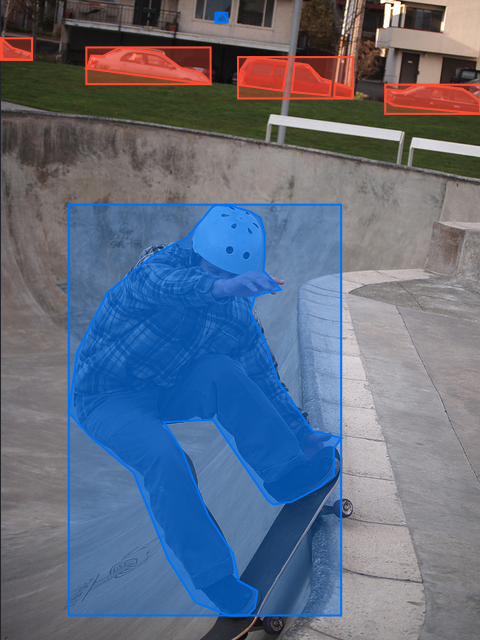

<p align="center">

</p>

<p align="center" style="font-style: italic">
A JSON-based format for working with machine learning data, with a focus on data interoperability.

<br />
<br />

<a href="https://www.gnu.org/licenses/gpl-3.0">
  
</a>
</p>

---

## About

**Droplet** is a JSON-based format for serializing and operating on machine learning annotations.  The primary goal of the format is to provide a structured way to specify an annotation to facilitate data interoperability and code reuse.

Though developed by [Zensors](https://zensors.com) for [dataTap](https://datatap.dev), Droplet is an open format and free for anyone to use.

## Why Droplet?

**Right now, every dataset and machine learning project uses its own data format.**  This drastically slows down the advancement of the field as more and more time is spent converting data between formats rather than working on algorithm improvements that drive real growth.  Moreover, with today's fragmented world of machine learning data formats, it's impossible to bring together data from multiple sources without spending time porting over the data.  Further, machine learning tools need to either be aware of all of these formats, or be rewritten from the ground up every time a new dataset emerges.

**Droplet is a standard format that solves this problem.**  By normalizing to a single format, we can:

- **Pull in data from multiple sources** – since every dataset is in the same format, you can mix and match annotations from different data sources with no effort.

- **Have a standardized set of tools** – code written for one project will work for every project.

- **Spend more time focusing on algorithms** - no more time needs to be spent on writing yet another set of one-off conversion scripts.

## Example

<table>
<tr>
<td>

```json
{
  "image": {
    "paths": [
      "http://images.cocodataset.org/train2017/000000541901.jpg",
      "http://farm6.staticflickr.com/5310/5619616662_c1e5b34bd3_z.jpg"
    ]
  },
  "classes": {
    "car": {
      "instances": [
        {
          "boundingBox": {
            "rectangle": [[0.1778, 0.0741], [0.4367, 0.1315]]
          }
        },
        {
          "boundingBox": {
            "rectangle": [[0.8004, 0.1322], [0.9991, 0.1779]]
          }
        },
        {
          "boundingBox": {
            "rectangle": [[0.4938, 0.0892], [0.7335, 0.1539]]
          }
        },
        {
          "boundingBox": {
            "rectangle": [[0.0000, 0.0598], [0.0648, 0.0936]]
          }
        }
      ]
    },
    "person": {
      "instances": [
        {
          "boundingBox": {
            "rectangle": [[0.1411, 0.3198], [0.7087, 0.9617]]
          }
        },
        {
          "boundingBox": {
            "rectangle": [[0.4468, 0.0199], [0.4716, 0.0353]]
          }
        }
      ]
    }
  }
}
```

</code></pre>
</td>
<td>

</td>
</tr>
</table>

## Specification

The Droplet specification has a few pieces that describe both the format and some features of its usage.  These are split into the following categories:

- [Concepts](./concepts.md)

- Common Types
  - [Geometry](./common/geometry.md)

- Annotation Types
  - [Image Annotation](./annotations/image-annotation.md)

## Using Droplet

In order to use droplet, you'll probably want to use bindings for whatever langauge you're using.  Right now, bindings for the following languages exist:

- Python: [`datatap-python`](https://github.com/zensors/datatap-python)

## Contributing

The current version of Droplet only has specific facilities for detection-style annotations on individual images, though other varieties of annotations (e.g., textual descriptions, relationships) and annotations on other subjects (e.g, video) will be added in the future. (???)

Have an idea for how to improve Droplet?  Open an issue with your idea in the issue tracker and we'll look into adding it to the spec!
