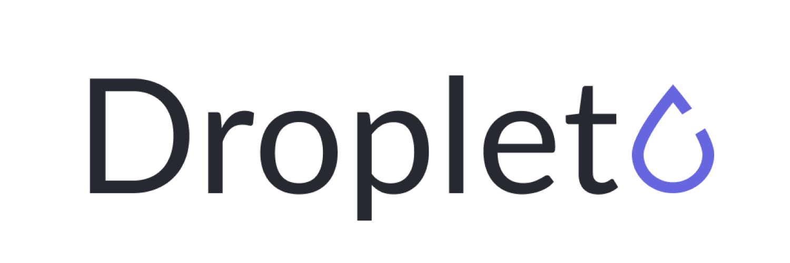

    

	A JSON-based format for working with machine learning data, with a focus on data interoperability.

---

## About

**Droplet** is a JSON-based format for serializing and operating on machine learning annotations.  The primary goal of the format is to provide a structured way to specify an annotation to facilitate data interoperability and code reuse.

Though developed by [Zensors](https://zensors.com) for [dataTap](https://datatap.dev), Droplet is an open format and free for anyone to use.

The current version of Droplet only has specific facilities for detection-style annotations on individual images, though other varieties of annotations (e.g., textual descriptions, relationships) and annotations on other subjects (e.g, video) will be added in the future.

## Specification

The Droplet specification has a few pieces that describe both the format and some features of its usage.  These are split into the following categories:

- [Concepts](./concepts.md)

- Common Types
	- [Geometry](./common/geometry.md)

- Annotation Types
	- [Image Annotation](./annotations/image-annotation.md)

## Using Droplet

In order to use droplet, you'll probably want to use bindings for whatever langauge you're using.  Right now, bindings for the following languages exist:

- Python: [`datatap-python`](https://github.com/zensors/datatap-python)

## Contributing

Have an idea for how to improve Droplet?  Open an issue with your idea in the issue tracker and we'll look into adding it to the spec!
